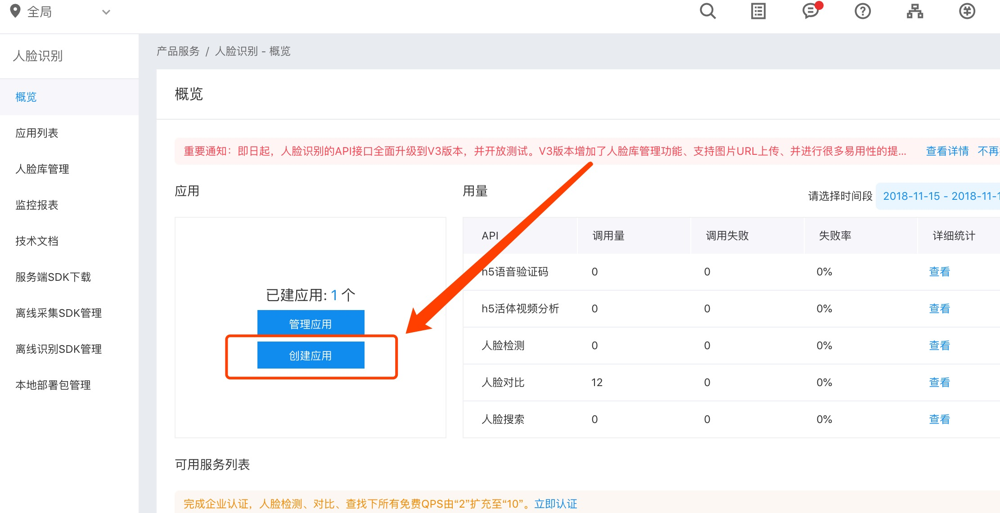

```
  __                             _               _    
 / _|                           | |             | |   
| |_   __ _   ___   ___         | |  ___    ___ | | __
|  _| / _` | / __| / _ \        | | / _ \  / __|| |/ /
| |  | (_| || (__ |  __/        | || (_) || (__ |   < 
|_|   \__,_| \___| \___|        |_| \___/  \___||_|\_\
                         ______                       
                        |______|                      


```
# 基于opencv和百度人脸识别api的锁屏程序
特色：
* [x] windows系统
* [x] mac系统
描述
当您离开电脑时，几秒后通过人脸识别技术，识别出您不在了，电脑自动锁屏；
当前电脑面前不是您在操作，也会自动锁屏；并拍照记录当前是谁。
因为调用的百度人脸api接口，确保当前电脑以联网。

###程序实现思路
利用opencv调用摄像头，提取用户照片，准备一张拍拍好的照片和用户照片，通过调用百度人脸识别api进行人脸识别。

### 人脸识别前景
利用人脸识别，做支付(下单，购物支付)，做解锁(比如开机解锁，锁屏解锁) 

### 环境依赖和项目结构：
```pyton
requests==2.18.4
urllib3==1.22
PyAutoGUI==0.9.38
opencv_python==3.4.3.18
Pillow==5.3.0
```
```
├── README.md
├── conf.ini
├── face_lock.py
├── log
├── picture
│   ├── baidu.jpg
│   ├── lock_pictures
│   └── myFace.jpg
└── requirements.txt
```
### 使用说明
* pip3 install -r requirements.txt 安装所需包
* 到[http://ai.baidu.com/tech/face] 百度人脸识别官网免费注册获得API_key 和access_key填到conf.ini文件相应位置
* 将picture文件夹的myFace.jpg文件替换成你的自拍
* python3 face_lock.py开始运行

### api更新说明
百度人脸api接口版本目前用的v3版，如果更新，自己手动修改接口程序
